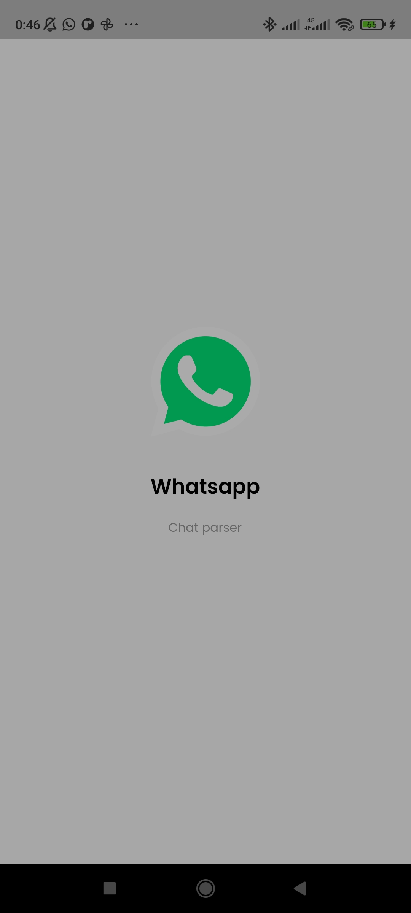
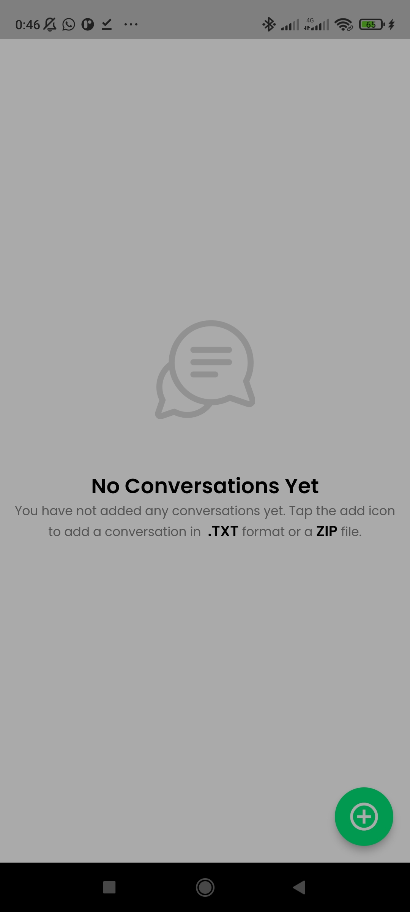

# 🔥🔥 Whatsapp Chat Parser

 

Whatsapp Chat Parser built with flutter.

Star⭐ the repo if you like what you see😉.

<!-- <a href="ss/app.apk"></img></a> -->

[Link to Mockup](https://www.ls.graphics/free/simple-iphone-x-mockups)

## Quick Start 🚀

## Feature Set ✨

* [x] Free & Open Source
* [x] Cross Platform App (Android - IOS)
* [x] Usable and user-friendly interface
* [x] Proper architecture for the code (We tried)
* [x] Import exported chats without media
* [x] View exported chats without media
* [x] Import exported chats with media
* [x] View exported chats with media
## RoadMap ✨
* [ ] UI Refresh
* [ ] Group chats by day

## 📸 ScreenShots

| Image| Image|
|------|-------|
|||
|||

## 🤓 Author(s)
**Samuel Abada** 